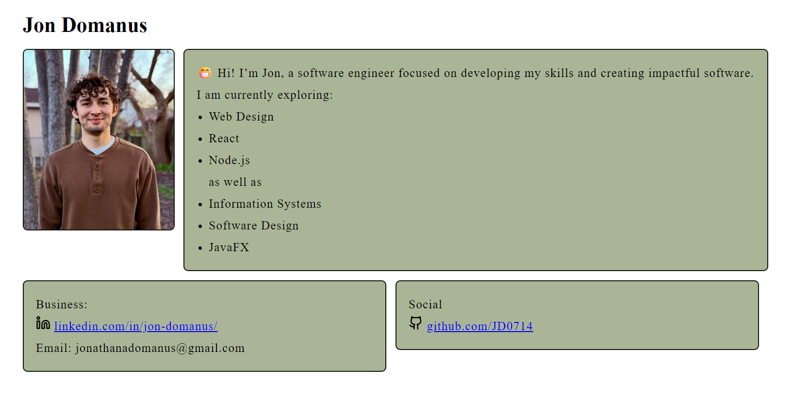

# Personal Portfolio Website

This is my personal portfolio website where I introduce myself, share my technical interests, and provide links to my professional profiles. I am Jon, a software engineering student focused on developing practical skills and creating software that is useful, organized, and easy to use.

## About Me

I am currently exploring web design, React, Node.js, information systems, software design, JavaFX, and business-related technology. This website gives visitors a quick overview of who I am, what I am learning, and how to contact me.

## Areas of Interest

- Web Design
- React
- Node.js
- Information Systems
- Software Design
- JavaFX
- Business and Technology

## Links

- LinkedIn: linkedin.com/in/jon-domanus/
- GitHub: github.com/JD0714
- Email: jonathanadomanus@gmail.com

## Screenshot

